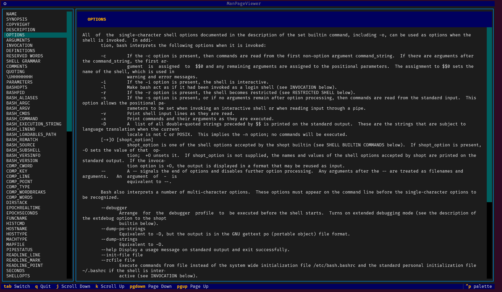

# manls

A Dash-style man page viewer for the terminal with section navigation.



## Features

- **Section Navigation**: Quick jump to any section via sidebar
- **Two-Panel Layout**: Sections on the left, content on the right
- **Scroll Support**: Smooth scrolling in both panels
- **Search**: Find man pages with `-k` option
- **Keyboard Navigation**: Full keyboard control


## Installation

```bash
cd manls
pip install -e .
```

Or run directly:

```bash
./manls <command>
```

## Usage

```bash
# View a man page
manls ls
manls bash

# Execute the comnand without a specific section
manls passwd

# View passwd section 5 (files) - note the difference with no section number
manls 5 passwd

# Search man pages
manls -k ssh
```

## Keyboard Shortcuts

| Key | Action |
|-----|--------|
| `Tab` | Switch between panels |
| `↑` / `↓` | Navigate sections (sidebar) |
| `j` / `k` | Navigate sections (sidebar) / Scroll content (content panel) |
| `q` | Quit |

## Requirements

- Python 3.8+
- [Textual](https://textual.textualize.io/) (TUI framework)
- Linux man pages (`man-db`)

## See Also

This project was inspired by Julia Evans' article [Notes on clarifying man pages](https://jvns.ca/blog/2026/02/18/man-pages/).

- [Español](./README-es.md)

## License

MIT
